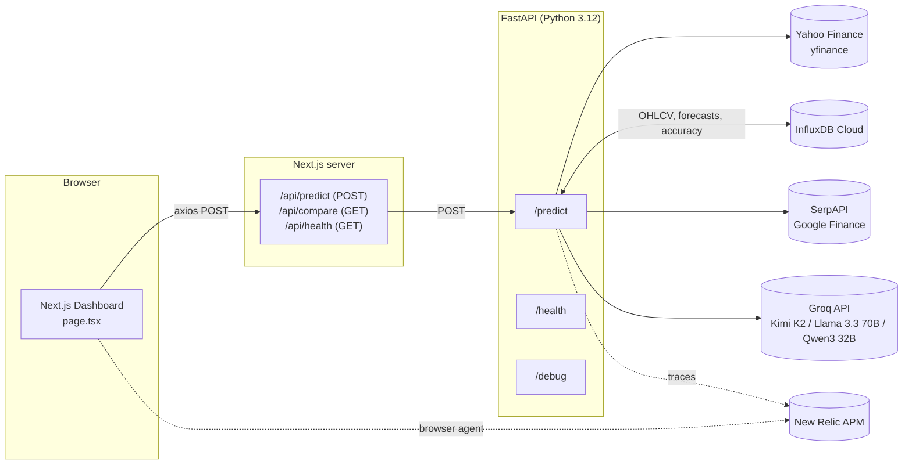
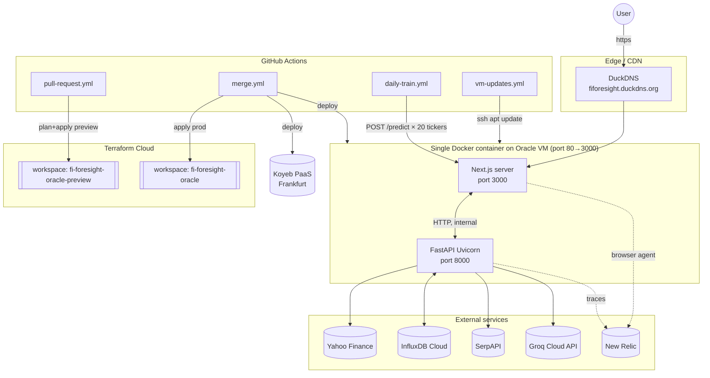
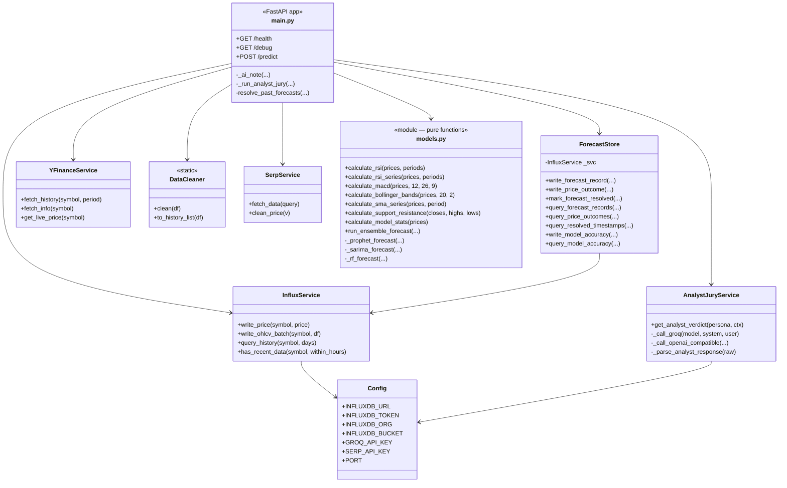
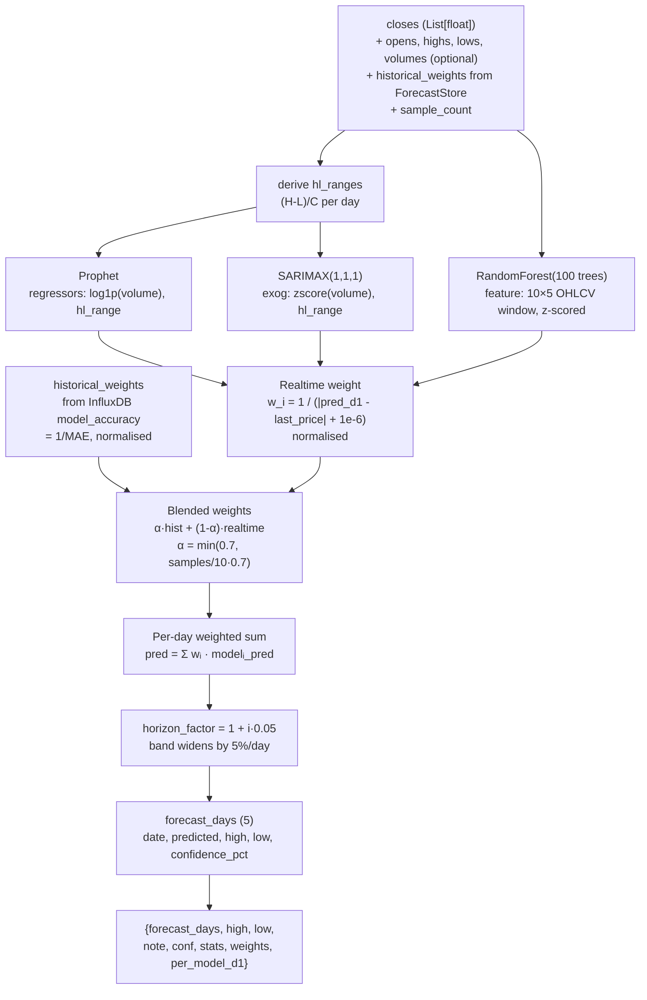
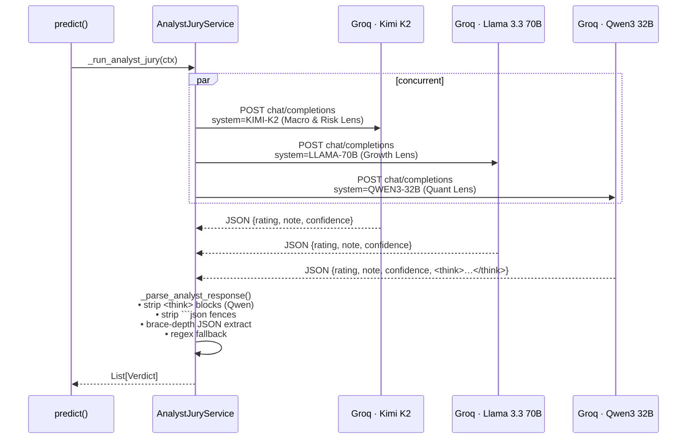
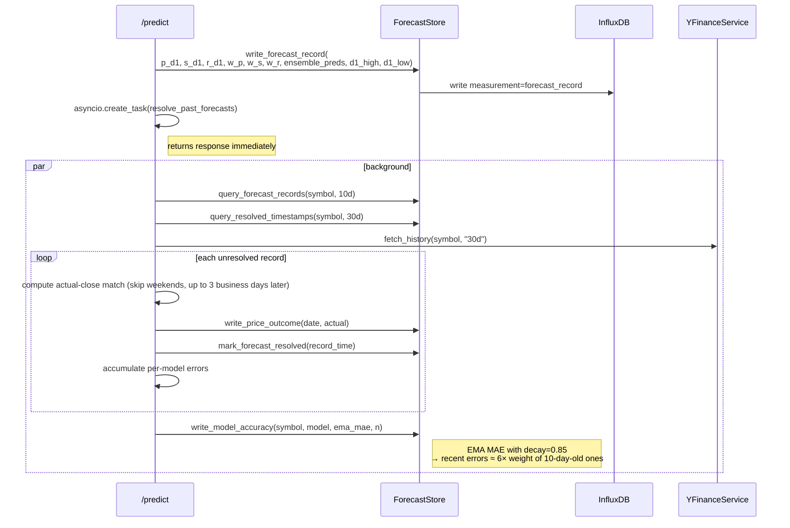
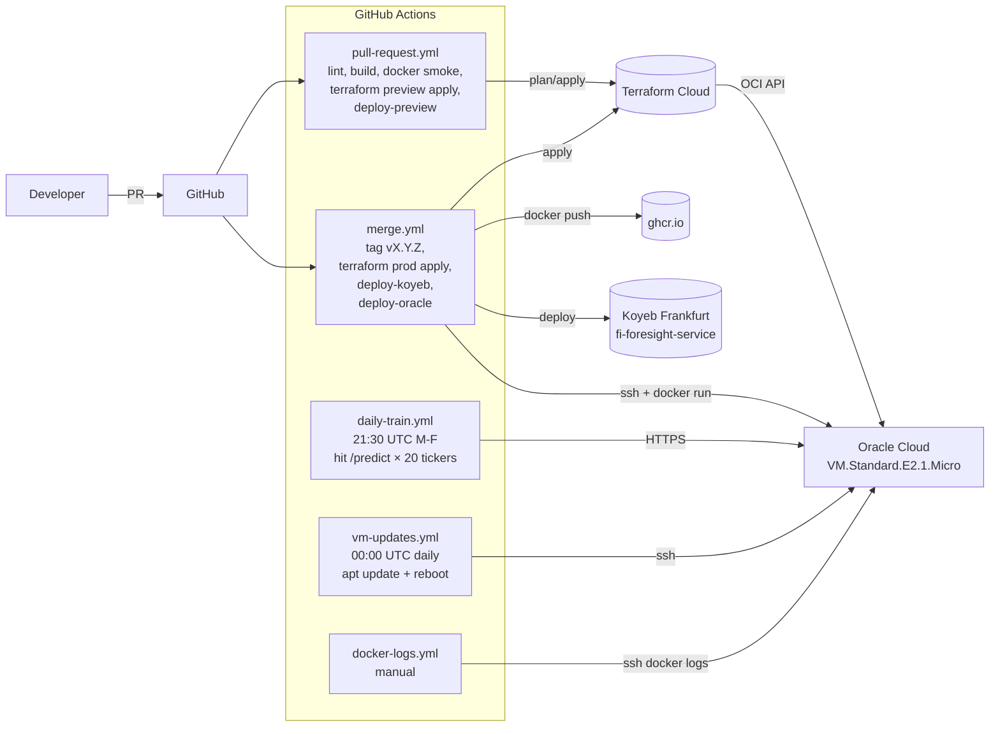
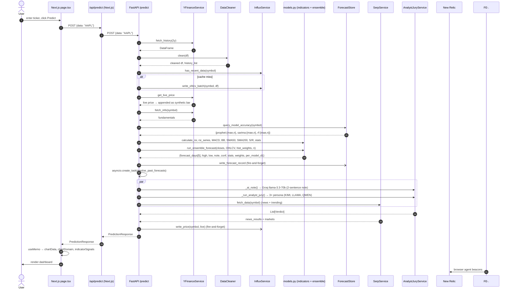

# FiForesight — Full Technical Documentation

> **Audience:** A developer who is new to this project. Basic programming knowledge is assumed; zero prior finance or ML knowledge is required.
>
> **Format:** This document is authored in GitHub-Flavored Markdown (GFM). Diagrams are written in [Mermaid](https://mermaid.js.org/) and will render natively on GitHub, GitLab, Notion, Confluence, and in most IDEs (VS Code + Mermaid preview extension). To export to `.docx` or `.pdf`, run `pandoc FiForesight-Documentation.md -o out.docx` (or `-o out.pdf`).
>
> **Source of truth:** Every section below was cross-checked against the actual source code in this repository. Line-number citations use the `path:line` convention.

---

## ⚠️ Discrepancies vs. Original Prompt

The documentation request mentioned several technologies that **do not match the current codebase**. The doc below describes what **actually** exists. Flagged for clarity:

| In request                                           | In code (truth)                                          |
| ---------------------------------------------------- | -------------------------------------------------------- |
| Project named **“Foresight”**                        | Named **FiForesight**                                    |
| **PostgreSQL** database                              | **InfluxDB** (time-series DB, OSS by InfluxData)         |
| **PyTorch**                                          | Not used. ML is **statsmodels** + **scikit-learn** + **Prophet** |
| **LSTM** model                                       | Not present. Models are **Prophet + SARIMAX + RandomForestRegressor** |
| **DeepSeek** LLM analysts, personas **Alpha / Bravo / Charlie / Delta** | **Groq API** is the provider. **3 personas** exist: **KIMI-K2**, **LLAMA-70B**, **QWEN3-32B** |
| 4-analyst jury                                       | 3-analyst jury                                           |

If any of those technologies are planned for the future, they are not in the code today and are **not** documented below.

---

## Table of Contents

1. [Project Overview](#1-project-overview)
2. [Tech Stack](#2-tech-stack)
3. [Architecture — High-Level Design (HLD)](#3-architecture--high-level-design-hld)
4. [Architecture — Low-Level Design (LLD)](#4-architecture--low-level-design-lld)
5. [Data Flow & Pipeline](#5-data-flow--pipeline)
6. [Math & Calculations Reference](#6-math--calculations-reference)
7. [ML Model Details](#7-ml-model-details)
8. [API Reference](#8-api-reference)
9. [Database Schema (InfluxDB)](#9-database-schema-influxdb)
10. [Frontend Structure](#10-frontend-structure)
11. [Setup & Running Guide (Windows-focused)](#11-setup--running-guide-windows-focused)
12. [Glossary](#12-glossary)

---

## 1. Project Overview

**FiForesight** is a full-stack web application that helps a user understand where a stock, ETF, index, or cryptocurrency is likely to move over the next five business days and *why*.

A user types a ticker symbol (e.g. `AAPL`, `SPY`, `BTC-USD`) into the dashboard. The backend:

1. Pulls two years of daily price history from Yahoo Finance (`yfinance`).
2. Computes standard technical indicators (RSI, MACD, Bollinger Bands, moving averages, support/resistance).
3. Runs an **ensemble** of three statistical / ML forecasting models (Prophet, SARIMAX, Random Forest) and blends their outputs using a weighting scheme that *learns* which model has been most accurate for this specific ticker over time (a very simple form of reinforcement learning).
4. Sends all of the above — plus live news headlines and fundamentals — to **three independent Large Language Models** (acting as three separate financial analyst personas) for commentary, a rating (`Strong Buy` / `Buy` / `Hold` / `Sell` / …), and a confidence score.
5. Returns everything as a single JSON payload that the Next.js frontend renders as a professional-looking dashboard with interactive charts, indicator overlays, an "analyst jury" panel, a 5-day forecast table, news, and trending tickers.

**Who it is for.**
- Retail investors who want a quick AI-assisted "second opinion" on a symbol.
- Engineers / students learning how to combine classical time-series models, tree ensembles, and LLMs in one production system.
- Anyone building a financial dashboard who wants a working reference for Prophet + SARIMAX + scikit-learn + FastAPI + Next.js + MUI + Recharts + InfluxDB.

**What problem it solves.**
- Most free retail tools either give you charts *or* an AI summary — rarely both, and rarely in one place with the math made transparent.
- Single-model forecasts are fragile; ensembles plus an LLM "jury" surface disagreement in a way a single black box cannot.
- The reinforcement-learning feedback loop means the system calibrates itself to the ticker you are actually looking at.

**What it is *not*.**
- Not trading infrastructure. It does not place orders.
- Not financial advice. See the disclaimer in [README.md:127](../README.md).

---

## 2. Tech Stack

Every piece of technology actually present in `package.json`, `backend/requirements.txt`, and the `dockerfile`, with the reason it was chosen and how it connects to the rest.

### 2.1 Frontend

| Technology                | Version (approx) | Where it is used                                            | Why this choice                                                |
| ------------------------- | ---------------- | ----------------------------------------------------------- | -------------------------------------------------------------- |
| **Next.js**               | 16.2.3           | All frontend rendering + `/api/*` proxy routes              | SSR-capable React framework; `app/api` routes give us a CORS-safe proxy to the Python backend without a separate gateway. |
| **React**                 | 19.2.4           | UI component layer                                          | Concurrent rendering + hooks; default choice for modern Next.js. |
| **TypeScript**            | 6.0.2            | All `.ts` / `.tsx` files                                    | Type safety for the large API response shape; `strict: false` (see [frontend/tsconfig.json](../frontend/tsconfig.json)) to keep onboarding friction low. |
| **MUI (Material UI)**     | 7.3.9            | `@mui/material`, `@emotion/react`, `@emotion/styled`        | Ready-made accessible components (Card, Chip, Autocomplete, Alert, Skeleton) + a theme system that we use for dark/light mode. |
| **Recharts**              | 3.8.1            | All price / indicator charts                                | Declarative SVG charting; composes well with React. The custom candlestick is a thin SVG overlay on top of a Recharts `ComposedChart` (see [frontend/app/page.tsx:1057](../frontend/app/page.tsx)). |
| **Tailwind CSS**          | 4.x              | Utility classes sprinkled throughout the UI                 | Pairs with MUI for quick layout tweaks without writing CSS files. |
| **Axios**                 | 1.15.0           | `handlePredict()` API call                                  | Simpler `try/catch` shape than `fetch` for request-body + error.response.data. |
| **Lucide React**          | 1.7.0            | All icons (Brain, Newspaper, Moon, Sun, Search, etc.)       | Tree-shakable SVG icon set. |
| **concurrently** (root)   | 9.2.1            | `pnpm run app:dev`                                          | Runs frontend + backend as one command in development. |
| **pnpm**                  | 10.33.0          | Package manager                                             | Faster installs + strict dependency graph. |

### 2.2 Backend

| Technology                | Where                                                    | Why                                                         |
| ------------------------- | -------------------------------------------------------- | ----------------------------------------------------------- |
| **Python**                | 3.12                                                     | Required by modern Prophet / statsmodels builds.             |
| **FastAPI**               | `backend/main.py`                                        | Async-first web framework with Pydantic validation.          |
| **Uvicorn**               | ASGI server                                              | Standard server for FastAPI; `--reload` in dev.              |
| **Pydantic**              | `PredictionResponse` in `backend/main.py:60`             | Runtime + static typing of the API response.                 |
| **httpx**                 | `backend/services.py` for SerpAPI + Groq calls           | Async HTTP client; compatible with FastAPI's event loop.     |
| **Prophet**               | `backend/models.py`, `_prophet_forecast()`               | Facebook's additive time-series model; handles weekly seasonality and allows extra regressors (volume, intraday range). |
| **statsmodels (SARIMAX)** | `backend/models.py`, `_sarima_forecast()`                | Classical ARIMA with exogenous variables; free and battle-tested. |
| **scikit-learn**          | `backend/models.py`, `_rf_forecast()` uses `RandomForestRegressor` | Random Forest on a sliding OHLCV window for a non-linear baseline. |
| **pandas / numpy**        | Everywhere                                               | DataFrame + array math.                                      |
| **yfinance**              | `backend/services.py`, `YFinanceService`                 | Free daily OHLCV + fundamentals — no API key needed.         |
| **InfluxDB Client**       | `backend/services.py`, `InfluxService`, `ForecastStore`  | Writes OHLCV, forecasts, and RL accuracy to InfluxDB Cloud. |
| **Groq API** (OpenAI-compatible) | `backend/services.py`, `AnalystJuryService`       | Hosts Kimi K2, Llama 3.3 70B, Qwen3 32B. Chosen over Gemini because Gemini's free tier caps at 20 requests/day; Groq's llama tier allows ~14,400/day. |
| **SerpAPI**               | `backend/services.py`, `SerpService`                     | Google Finance news + trending tickers.                      |
| **newrelic**              | `backend/newrelic.ini` + `@newrelic.agent.function_trace()` decorators | APM; traces every model call and every Groq call individually. |
| **python-dotenv**         | `backend/config.py`                                      | Loads `.env` next to `config.py` regardless of CWD.          |

### 2.3 Data & Infra

| Technology             | Role                                                                                      |
| ---------------------- | ----------------------------------------------------------------------------------------- |
| **InfluxDB (Cloud)**   | Time-series store for OHLCV, forecast records, actual outcomes, and per-model accuracy.  |
| **Docker**             | Multi-stage image: Node builds Next.js, Python venv ships the backend; both run side-by-side in one container listening on port 3000. |
| **Terraform**          | Provisions the Oracle Cloud VM (VCN, subnet, security list, compute instance). State is in Terraform Cloud. |
| **GitHub Actions**     | Five workflows: PR build/preview, merge/release/prod, manual docker-logs, daily RL training, nightly VM apt-updates. |
| **Koyeb**              | Managed container PaaS — free-tier Frankfurt deployment on merge.                        |
| **Oracle Cloud (OCI)** | Always-Free E2.1.Micro VM behind DuckDNS at `fiforesight.duckdns.org` (prod) and `fiforesight-preview.duckdns.org` (preview). |
| **New Relic APM**      | Server-side Python agent + browser agent (injected via `<Script>` in `frontend/app/layout.tsx`). |

### 2.4 How the pieces connect



---

## 3. Architecture — High-Level Design (HLD)

### 3.1 System-level diagram



### 3.2 Component responsibilities (HLD)

| Component                | Responsibility                                                                                  |
| ------------------------ | ------------------------------------------------------------------------------------------------ |
| **Browser (Next.js dashboard)** | Collects the ticker, renders charts/cards, handles dark/light toggle, runs New Relic browser agent. |
| **Next.js server (`app/api/*`)** | Thin proxy layer. Adds no business logic; only forwards requests to FastAPI and normalizes errors. |
| **FastAPI backend**      | Orchestrates one `/predict` request: fetch data → clean → compute indicators → ensemble forecast → jury → news → response. |
| **InfluxDB**             | Persistent store for OHLCV (last 29 days — retention window of the free tier), forecast records, resolved outcomes, and rolling per-model accuracy. |
| **Yahoo Finance**        | Authoritative source for 2-year daily OHLCV and fundamentals; runs on every request.             |
| **SerpAPI**              | Live news headlines + trending tickers.                                                          |
| **Groq API**             | Hosts the three LLM personas; each call is OpenAI-compatible.                                    |
| **New Relic**            | End-to-end APM. `@newrelic.agent.function_trace()` decorators produce per-function spans; the browser agent reports page timings and JS errors. |
| **Docker container**     | Ships Next.js + FastAPI together; simplifies networking (proxy hops are `localhost`).            |
| **Terraform Cloud**      | Infrastructure-as-code for the Oracle VM (VCN, subnet, security list, instance, cloud-init).    |
| **GitHub Actions**       | PR → preview deploy; main → semantic version + GHCR image + Koyeb + Oracle deploy; daily RL training; nightly VM patching. |

---

## 4. Architecture — Low-Level Design (LLD)

This section drills into each subsystem.

### 4.1 Module map (backend)

Backend is deliberately tiny — four files plus a config INI:

```
backend/
├── config.py       # Env var loading + log sanitization filter
├── main.py         # FastAPI routes + orchestration of one /predict request
├── models.py       # Pure functions: indicators + ensemble forecasting
├── services.py     # Service classes: Influx / Forecast store / YFinance /
│                   # DataCleaner / SerpAPI / AnalystJuryService
│                   # + ANALYST_PERSONAS list
└── newrelic.ini    # APM agent config
```

### 4.2 Class / module diagram (backend)



### 4.3 API layer (LLD)

| Endpoint             | File / line                          | Behaviour                                                                                                  |
| -------------------- | ------------------------------------ | ---------------------------------------------------------------------------------------------------------- |
| `GET  /health`       | [backend/main.py:512](../backend/main.py) | Returns `{status: "ok", timestamp: <ISO>}`. Used by Docker healthcheck, Koyeb, and `docker-logs.yml`. |
| `GET  /debug`        | [backend/main.py:517](../backend/main.py) | Reports availability flags for yfinance, InfluxDB, Groq, SerpAPI, ML packages; attempts a sample yfinance fetch. Use in a browser when diagnosing 500s. |
| `POST /predict`      | [backend/main.py:558](../backend/main.py) | The main orchestration endpoint. Body: `{"data": "AAPL"}`. Returns the full `PredictionResponse` described in §8. |

FastAPI provides automatic OpenAPI docs at `GET /docs` (Swagger UI) and `GET /redoc`.

#### Exception handler
`main.py:36` registers a global `@app.exception_handler(Exception)` that logs the full traceback and returns a plain `{"detail": "An internal server error occurred."}` with HTTP 500 — tracebacks never reach the client.

### 4.4 Data ingestion (LLD)

```mermaid
sequenceDiagram
  participant Predict as main.py /predict
  participant YF as YFinanceService
  participant Cleaner as DataCleaner
  participant Influx as InfluxService

  Predict->>YF: fetch_history(symbol, "2y")
  YF-->>Predict: DataFrame (≈500 rows OHLCV)
  Predict->>Cleaner: clean(df)
  Note over Cleaner: 1) drop NaN/zero Close<br/>2) remove >4σ outliers<br/>3) bdate_range reindex + ffill(price); volume=0<br/>4) enforce High≥Close≥Low
  Cleaner-->>Predict: cleaned DataFrame
  Predict->>Influx: has_recent_data(symbol, 20h)
  alt cache miss
    Predict->>Influx: write_ohlcv_batch(symbol, df)
    Note right of Influx: only last 29 days are persisted<br/>(free-tier retention)
  end
  Predict->>YF: get_live_price(symbol)
  YF-->>Predict: latest price float
  Predict->>Predict: append live bar<br/>(close=high=low=open=live; volume=0)
```

**Key design note (cache direction).** [backend/main.py:567-614](../backend/main.py) comments explain the trade-off: InfluxDB Cloud's free tier has a **29-day retention window** and cannot hold the 2 years we need for model training. Therefore yfinance is the **primary** source on every request, and InfluxDB is only used to persist the last 29 days for downstream analytics and the RL feedback loop.

### 4.5 Technical indicator pipeline (LLD)

Indicator functions are all in [backend/models.py](../backend/models.py), lines 40-302. They are pure (stateless) and take a `List[float]` of closes (and for S/R, intraday H/L).

```mermaid
flowchart LR
  Closes[closes array<br/>N points]
  OHLCV[OHLCV arrays]

  Closes --> RSI[calculate_rsi / calculate_rsi_series<br/>EWM Wilder, α=1/14]
  Closes --> MACD[calculate_macd<br/>EMA12 - EMA26, signal=EMA9]
  Closes --> BB[calculate_bollinger_bands<br/>SMA20 ± 2·σ20]
  Closes --> SMA50[calculate_sma_series(50)]
  Closes --> SMA200[calculate_sma_series(50)]
  OHLCV --> SR[calculate_support_resistance<br/>local extrema + cluster]
  Closes --> Stats[calculate_model_stats<br/>ann_vol, slope, SMA20, %vs SMA20]

  subgraph Response
    R[indicators block]
  end

  RSI --> R
  MACD --> R
  BB --> R
  SMA50 --> R
  SMA200 --> R
  SR --> R
  Stats --> R
```

### 4.6 ML model pipeline (LLD)



### 4.7 LLM analyst-jury mechanism (LLD)

The jury lives in [backend/services.py:939-1279](../backend/services.py). Three persona dicts are declared at module level (the `ANALYST_PERSONAS` list) and the class `AnalystJuryService` dispatches them concurrently.



**No consensus is computed on the backend.** The frontend (`AnalystJuryPanel` in `app/page.tsx`) derives a single consensus rating from the 3 verdicts and flags "SPLIT" when they disagree. See §10 for details.

Rating vocabulary (valid strings the LLMs may return): `Strong Buy`, `Buy`, `Accumulate`, `Low Risk`, `Hold`, `Medium Risk`, `Distribute`, `Sell`, `High Risk`, `Strong Sell`.

### 4.8 RL accuracy-feedback loop (LLD)

Every `/predict` call records the forecast, then fires-and-forgets a background task that resolves previously written forecasts against the actual close that has since materialised. This is a very simple RL loop: the "policy" is the weight vector; the "reward" is inverse MAE.



### 4.9 Frontend architecture (LLD)

```mermaid
flowchart TB
  subgraph NextRoot[Next.js app directory]
    Layout[app/layout.tsx<br/>HTML shell + &lt;Script&gt; injection<br/>newrelic.live.js or .preview.js]
    Page[app/page.tsx<br/>&quot;use client&quot; — ~1,365 lines]
    APIP[app/api/predict/route.ts]
    APIC[app/api/compare/route.ts]
    APIH[app/api/health/route.ts]
  end

  subgraph PageState[State held in page.tsx]
    S1[themeMode]
    S2[ticker, exchange]
    S3[prediction: PredictionData]
    S4[loading, error]
    S5[indicators: IndicatorKey[]]
    S6[chartMode, legendOpen]
  end

  subgraph Inline[Inline sub-components]
    MS[MiniSparkline]
    CB[ConfidenceBadge]
    AJP[AnalystJuryPanel]
    SK1[ChartSkeleton]
    SK2[SidebarSkeleton]
  end

  subgraph Memos[useMemo derivations]
    M1[chartData]
    M2[candleChartData]
    M3[macdData, rsiData, volumeData]
    M4[chartDomain]
    M5[chartStats]
    M6[indicatorSignals]
    M7[trendingSparklines]
  end

  Page -->|axios POST| APIP
  APIP -->|http| FastAPI[(FastAPI /predict)]
  Page --> PageState
  Page --> Memos
  Page --> Inline
```

No external state store (no Redux, no Zustand, no Context). All state is local `useState`; all derivations are `useMemo` on `prediction`. This is deliberate — kept simple because the dashboard has only one API call per ticker.

### 4.10 Infrastructure & deployment (LLD)



Composite actions used by the workflows:

| Action                              | Job                                                                                            |
| ----------------------------------- | ---------------------------------------------------------------------------------------------- |
| `.github/actions/terraform`         | `terraform init → validate → plan → apply`. Applies unconditionally for preview; only on `push` for prod. |
| `.github/actions/deploy-oracle`     | DuckDNS DNS update → install New Relic infra agent → `docker login ghcr.io` → `docker run -p 80:3000 …` → register New Relic deployment marker. |
| `.github/actions/deploy-koyeb`      | Create/update Koyeb secrets → `koyeb/action-git-deploy` with the GHCR image.                   |
| `.github/actions/setup-secrets`     | Re-exports every API key/secret as a Koyeb secret.                                             |

---

## 5. Data Flow & Pipeline

This is the **end-to-end trace** of one `/predict` request, with the exact code locations that handle each step.



### Step-by-step narrative

| # | Phase                              | Code                                                 | Notes |
| - | ---------------------------------- | ---------------------------------------------------- | ----- |
| 1 | User submits ticker                | [frontend/app/page.tsx:415-427](../frontend/app/page.tsx) | `handlePredict` uses axios. |
| 2 | Proxy                              | [frontend/app/api/predict/route.ts](../frontend/app/api/predict/route.ts) | Pure passthrough; only error shape normalised. |
| 3 | Fetch 2-year OHLCV                 | [backend/main.py:577-614](../backend/main.py)           | `yfinance` is always primary. InfluxDB is a 29-day cache. |
| 4 | Clean                              | [backend/services.py:725-859](../backend/services.py)   | NaN drop → 4σ outlier removal (rolling 30-day median) → bdate_range reindex with `ffill` on prices and `0` on volume → High≥Close≥Low enforcement. |
| 5 | Append live price                  | [backend/main.py:619-636](../backend/main.py)           | Live price gets `open=high=low=close=live`, `volume=0`. Downstream code later replaces zero volumes with the rolling mean so synthetic bars don't poison normalisation. |
| 6 | Fundamentals                       | [backend/main.py:638-654](../backend/main.py)           | `yf.Ticker(symbol).info` → market cap, P/E, prev close, 52-w range, sector, currency. |
| 7 | RL: historical per-model weights   | [backend/main.py:679-720](../backend/main.py)           | `ForecastStore.query_model_accuracy(symbol)` → inverse-MAE, normalised. |
| 8 | Indicators + stats                 | [backend/main.py:722-780](../backend/main.py)           | See §6 for formulas. |
| 9 | Ensemble forecast                  | [backend/models.py:610-943](../backend/models.py)       | See §7. |
| 10 | RL: write this forecast            | [backend/main.py:744-758](../backend/main.py)          | Fire-and-forget via `_safe_background`. |
| 11 | RL: resolve past forecasts         | [backend/main.py:331-505](../backend/main.py)          | Background: match old forecast records against actual closes, update model_accuracy with EMA MAE (decay=0.85). |
| 12 | AI header note                     | [backend/main.py:113-154](../backend/main.py)          | Single Groq call to `llama-3.3-70b-versatile`. |
| 13 | Analyst jury (3 personas)          | [backend/main.py:157-324](../backend/main.py)          | `asyncio.gather` → `AnalystJuryService.get_analyst_verdict` × 3. |
| 14 | News + trending                    | [backend/main.py:813-848](../backend/main.py)          | SerpAPI (engine=google_finance). Non-fatal if unavailable. |
| 15 | Write live-price snapshot to Influx | [backend/main.py:850-858](../backend/main.py)          | Fire-and-forget. |
| 16 | Build chart history (last 90 bars) | [backend/main.py:860-893](../backend/main.py)          | Trims indicator arrays to the same 90-bar window. |
| 17 | Return `PredictionResponse`        | [backend/main.py:905-929](../backend/main.py)          | See §8 for full schema. |
| 18 | Frontend renders                   | [frontend/app/page.tsx](../frontend/app/page.tsx)      | `useMemo` derives chartData/chartDomain/indicatorSignals; `AnalystJuryPanel` computes consensus. |

---

## 6. Math & Calculations Reference

> **This section is self-contained.** Every number visible on the dashboard can be looked up here. Each entry shows: plain-English meaning → mathematical definition → source code → what it tells you.

### 6.1 Price returns and annualised volatility

Used in `calculate_model_stats` ([backend/models.py:271](../backend/models.py)) and displayed as **"Volatility (ann.)"** in the fundamentals grid.

- **Simple daily return:** `r_t = (P_t − P_{t−1}) / P_{t−1}`
- **Annualised volatility:** `σ_ann = σ(r) · √252`
  - `252` is the number of US trading days per year.
  - `σ(r)` is the sample standard deviation of daily returns over the entire OHLCV history.
- **Displayed as a percentage:** `σ_ann · 100`.

**What it tells you.** Higher = the stock swings more; lower = calmer. Useful for sizing positions and comparing tickers on the same scale.

### 6.2 Trend slope

Shown as **"Trend slope"** in the fundamentals grid.

- Takes the last 20 closes, fits a simple 1-D linear regression
  `P_t ≈ a + b·t`, `t = 0,1,…,19`, using `numpy.polyfit(deg=1)`.
- `b` is reported verbatim (units: price change per day).

**What it tells you.** Positive = uptrending; negative = downtrending. Magnitude is in dollars per day over the last month.

### 6.3 SMA (Simple Moving Average)

- **SMA_N(t) = mean(P_{t−N+1}, …, P_t)**
- Code: [models.py:107](../backend/models.py) — `pandas.Series.rolling(window=N).mean()`.
- **SMA20** is also surfaced as `sma_20` in `model_stats`.
- **SMA50** and **SMA200** are drawn as overlays on the price chart.

**What it tells you.** SMA50 crossing above SMA200 is a **"golden cross"** (bullish). The reverse is a **"death cross"** (bearish). The frontend computes this label in `indicatorSignals` ([page.tsx:568-669](../frontend/app/page.tsx)).

### 6.4 Price vs. SMA20 (%)

- `(last_price − SMA20) / SMA20 · 100`
- Code: `price_vs_sma20_pct` in [models.py:288](../backend/models.py).

**What it tells you.** Positive = trading above the one-month average; negative = below.

### 6.5 RSI (Relative Strength Index, Wilder smoothing)

Two functions exist and both use **Wilder's EWM smoothing** (`α = 1 / periods`, i.e. `com = periods−1`):

- `calculate_rsi_series` at [models.py:120](../backend/models.py) — returns the full per-point series.
- `calculate_rsi` at [models.py:140](../backend/models.py) — returns the latest scalar.

**Formula.**
1. `Δ_t = P_t − P_{t−1}`
2. `U_t = max(Δ_t, 0)`, `D_t = max(−Δ_t, 0)`
3. `avgU_t = EWM_{α=1/14}(U_t)`, `avgD_t = EWM_{α=1/14}(D_t)`
4. `RS_t = avgU_t / avgD_t`
5. `RSI_t = 100 − 100 / (1 + RS_t)`

Edge cases: flat price (both zero) → 50; no losses → 100; insufficient data → 50.

**Numerical consistency.** Both functions share the *same* algorithm — the comment at [models.py:142-147](../backend/models.py) warns that a previous version used a simple rolling mean in `calculate_rsi`, causing a ~7-point divergence vs the charted series.

**What it tells you.** >70 = overbought (potential pullback); <30 = oversold (potential bounce); 30–70 = neutral.

### 6.6 MACD (Moving Average Convergence Divergence)

Code: `calculate_macd` at [models.py:40](../backend/models.py).

1. `EMA_fast = EWM_{span=12}(close)`
2. `EMA_slow = EWM_{span=26}(close)`
3. `MACD = EMA_fast − EMA_slow`
4. `Signal = EWM_{span=9}(MACD)`
5. `Histogram = MACD − Signal`

**What it tells you.**
- `MACD > Signal` → **bullish** cross.
- Growing positive histogram → strengthening uptrend.
- Zero-line crossings mark trend changes.

### 6.7 Bollinger Bands

Code: `calculate_bollinger_bands` at [models.py:78](../backend/models.py).

- `middle_t = SMA20(close)`
- `σ_t = StdDev20(close)` (20-period sample SD)
- `upper_t = middle_t + 2·σ_t`
- `lower_t = middle_t − 2·σ_t`

**Displayed "BB position (% of band)"** on the frontend:
`(price − lower) / (upper − lower) · 100` — where on the band the current price sits (0 % = on lower band, 100 % = on upper band).

**What it tells you.** Price near the upper band = stretched up; near the lower = stretched down; band width is a volatility proxy (squeeze → expansion is a popular setup).

### 6.8 Support & Resistance

Code: `calculate_support_resistance` at [models.py:177](../backend/models.py).

1. Take the last 65 bars.
2. Over a sliding window of 5 bars on each side (11-bar neighbourhood):
   - `Low_t` is a **support candidate** if it equals the min of its neighbourhood.
   - `High_t` is a **resistance candidate** if it equals the max of its neighbourhood.
3. Cluster nearby candidates: walk sorted candidates, merge any value within **1.5 %** of the running cluster mean.
4. Keep only levels **below** the last price (as support) or **above** (as resistance), sorted by proximity, top 3 each.

**What it tells you.** Prices tend to bounce off these levels; crossing them often triggers follow-through.

### 6.9 Horizon factor for forecast bands

Inside `run_ensemble_forecast` ([models.py:859](../backend/models.py)):

- `horizon_factor = 1 + i·0.05` where `i ∈ {0,1,2,3,4}` is the forecast day index (day 1 → factor 1.00, day 5 → factor 1.20).
- For each day: `day_high = predicted + (raw_high − predicted) · horizon_factor`, and symmetrically for `day_low`.

The comment at [models.py:854-858](../backend/models.py) explains the **bug this replaces**: an earlier version multiplied the absolute price by the factor, producing absurd ±20 % bands by day 5. The new formula widens only the distance from the predicted mean.

### 6.10 Ensemble weighting

- **Realtime weight** (per model that ran successfully):
  `raw_w = 1 / (|pred_d1 − last_price| + 1e-6)`
  then normalise so Σ = 1.
- **Historical weight** (from `ForecastStore.query_model_accuracy`):
  `hist_w = 1 / (MAE + 1e-6)`, normalised.
- **Blended weight:**
  `w = α · hist_w + (1 − α) · realtime_w`, where
  `α = min(0.7, sample_count / 10 · 0.7)` (ramps linearly from 0 to 0.7 over the first 10 resolved samples, then caps).
  Any model that failed keeps weight 0 after blending.

Code: [models.py:781-822](../backend/models.py).

### 6.11 Per-day confidence

Each `forecast_days[i].confidence_pct` is computed at [models.py:865-867](../backend/models.py):

- `base_conf = 40 + (n_price_points // 10) + (n_models_succeeded · 10)`
- `confidence_pct[i] = clamp(base_conf − i · 5, 10, 90)`

More history → higher confidence; farther out in time → lower confidence; failed models drag it down.

### 6.12 Overall confidence label

Code: [models.py:916-919](../backend/models.py).

- `"high"` if `n_points > 100` **and** all 3 models ran.
- `"medium"` if `n_points > 40`.
- `"low"` otherwise.

### 6.13 Predicted direction line in `analystNote`

Inside the ensemble's auto-generated narrative ([models.py:890-912](../backend/models.py)):

- `direction = "upward"` if `d5_predicted > last_price` else `"downward"`
- `pct_change = |d5_predicted − last_price| / last_price · 100`
- `vol_label = "high"` if `vol > 3 %` else `"moderate"` if `vol > 1.5 %` else `"low"`

### 6.14 EMA decay for the RL MAE

- Code: [backend/main.py:467-489](../backend/main.py).
- `decay = 0.85`. On each new error:
  `MAE_t = decay · MAE_{t−1} + (1 − decay) · |pred − actual|`
- Because `decay = 0.85`, a 10-day-old error has weight `0.85^10 ≈ 0.20`, i.e. the most recent error is roughly **6×** more influential than a 10-day-old one.

### 6.15 Band hit rate

Logged (not returned) at [backend/main.py:491-499](../backend/main.py):

- For each resolved day-1 forecast, `hit = 1` if `d1_low ≤ actual ≤ d1_high`, else `0`.
- `band_hit_rate = Σ hits / N`.

**What it tells you.** How often the true close actually landed inside the day-1 prediction band. Visible only in server logs.

### 6.16 Frontend display values

These are computed in [frontend/app/page.tsx](../frontend/app/page.tsx) and are the last link in the chain before the user reads them:

| Label on screen                  | Formula                                                             | Source                            |
| -------------------------------- | ------------------------------------------------------------------- | --------------------------------- |
| **Change** (header)              | `last − first` across the currently displayed 90-bar window          | `chartStats` memo                 |
| **Change %**                     | `(last − first) / first · 100`                                       | `chartStats` memo                 |
| **High / Low** (header stats)    | `max(close)` / `min(close)` over the displayed window                 | `chartStats` memo                 |
| **Y-axis domain**                | `[min − 12 %·range, max + 12 %·range]` of all visible series         | `chartDomain` memo                |
| **Trending sparkline**           | 12 pseudo-random points derived deterministically from the ticker   | `trendingSparklines` memo         |
| **Analyst jury consensus**       | First rating in the `RATING_ORDER` precedence list that has a plurality; "SPLIT" if verdicts disagree. | `AnalystJuryPanel` ([page.tsx:225](../frontend/app/page.tsx)) |
| **Confidence badge colour**      | Green ≥ 70 %, cyan ≥ 50 %, amber < 50 %                              | `ConfidenceBadge` ([page.tsx:185](../frontend/app/page.tsx)) |

---

## 7. ML Model Details

### 7.1 Model 1 — Prophet (univariate, with regressors)

- **Purpose.** Capture additive trend + weekly seasonality in the close price.
- **Training data.** Full cleaned close history aligned to a business-day index.
- **Features.**
  - Target `y` = close
  - Regressors: `volume_log = log1p(volume)` and `hl_range = (high − low) / close`
  - Future values of regressors are estimated as the **mean of the last 5 training days**.
- **Hyperparameters** ([models.py:362-367](../backend/models.py)):
  - `daily_seasonality=False`
  - `weekly_seasonality=True`
  - `changepoint_prior_scale=0.05`
  - `interval_width=0.80` (80 % CI on forecast output)
- **Output.** `(steps, 3)` array: `[yhat, yhat_lower, yhat_upper]` for each of 5 business-day horizons.

### 7.2 Model 2 — SARIMAX(1,1,1)

- **Purpose.** Capture autoregressive dynamics and incorporate volume / intraday range as exogenous signals.
- **Specification.** `SARIMAX(order=(1,1,1), exog=[z-score(volume), hl_range])`.
- **Normalisation.** Volume is z-score normalised so it does not dominate the coefficient scale; `hl_range` is already O(1).
- **Fit options.** `enforce_stationarity=False`, `enforce_invertibility=False` (avoids fit failures on non-stationary series).
- **Future exog.** Mean of last 5 days, tiled for `steps` rows.
- **Output.** `(steps, 3)` array: `[predicted_mean, ci_low(80 %), ci_high(80 %)]` (from `fc.conf_int(alpha=0.20)`).

### 7.3 Model 3 — Random Forest (sliding OHLCV window)

- **Purpose.** Non-linear baseline on a multi-feature sliding window.
- **Feature construction.**
  - `window = 10` bars.
  - **OHLCV mode** (when all of O/H/L/V are available): column-wise z-score normalise the 5-column matrix, then flatten the last 10 rows → **50 features**.
  - **Closes-only fallback** (e.g. when OHLCV missing): last 10 closes as 10 features.
- **Training.** `RandomForestRegressor(n_estimators=100, random_state=42)`.
- **Multi-step prediction.** Roll the window forward one day at a time, carrying the last known O/H/L/V and replacing only the Close with each step's prediction (this is a naïve recursion — documented as a known simplification in the code comments at [models.py:553-567](../backend/models.py)).
- **Band estimation.** `band = pred · σ(last 20 closes) / mean(last 20 closes) · 1.5`. Symmetric band around each prediction.

### 7.4 Ensemble blend (what binds the 3 models)

See §6.10 and [models.py:781-876](../backend/models.py). Weights are per-request and can *blend with* historical per-model MAE stored in InfluxDB. The resulting weighted sum produces:

- `predicted` per day → used for the forecast table and the extended price chart line.
- `high / low` per day → band, widened with `horizon_factor` for the outer 4 days.
- `confidence_pct` per day → §6.11.

### 7.5 LLM Analyst Jury (ML from a different angle)

| Persona / File                                | Groq model                       | Role                        | System prompt source             |
| --------------------------------------------- | -------------------------------- | --------------------------- | -------------------------------- |
| **KIMI-K2** (Macro & Risk Lens)               | `moonshotai/kimi-k2-instruct`    | Downside / systemic risk    | [services.py:948-960](../backend/services.py) |
| **LLAMA-70B** (Growth Lens)                   | `llama-3.3-70b-versatile`        | Upside / momentum / catalysts | [services.py:970-981](../backend/services.py) |
| **QWEN3-32B** (Quant Lens)                    | `qwen/qwen3-32b`                 | Pure technicals / signals   | [services.py:992-1002](../backend/services.py) |

**Shared context** (built in `_run_analyst_jury` at [main.py:184-295](../backend/main.py)) includes: symbol, price, RSI, sector, fundamentals, recent closes, 5-day forecast high/low + confidence, annualised volatility + slope + vs. SMA20, MACD state, Bollinger state (upper/mid/lower + %-of-band), SMA50/200 with % distance, 10d-vs-30d volume comparison, top 2 support/resistance levels, optional news block (opportunistic), and the model track record.

**Output contract** (enforced at [services.py:1007-1012](../backend/services.py)):

```json
{
  "rating":     "<Strong Buy|Buy|Hold|Sell|Strong Sell|Low Risk|Medium Risk|High Risk|Accumulate|Distribute>",
  "note":       "<3-4 advisory sentences, up to 420 chars>",
  "confidence": <integer 10-95>
}
```

**Parsing is defensive** (`_parse_analyst_response` at [services.py:1109-1211](../backend/services.py)):

1. Strip reasoning-model `<think>…</think>` blocks (Qwen3 emits these).
2. Strip markdown ``` ``` ``` fences.
3. Primary: brace-depth JSON extraction (finds first `{`, walks to matching `}`).
4. Secondary: `json.loads` on the whole cleaned string.
5. Last-resort: regex to pick a rating keyword + a `NN%` number and truncate the remaining text to the `note` field.

If the Groq call fails outright, the persona returns `{rating: Hold, confidence: 25, note: "Model unavailable — no verdict at this time.", model: "error"}`.

### 7.6 Header analyst note

A separate, smaller Groq call (`llama-3.3-70b-versatile`) produces the 2-sentence header note shown above the chart. Falls back to the ensemble's auto-generated `note` if Groq is down. See [`_ai_note` in main.py:113-154](../backend/main.py).

### 7.7 How predictions flow into personas

```
run_ensemble_forecast(...)
   └─ forecast dict { high, low, conf, stats, weights, per_model_d1, forecast_days }
                    │
                    ▼
   _run_analyst_jury(symbol, closes, rsi, forecast, stats, info, macd, bb, sma50, sma200, ...)
                    │
                    │   builds `ctx` string combining all of the above
                    ▼
   asyncio.gather(
       get_analyst_verdict(KIMI-K2, ctx),
       get_analyst_verdict(LLAMA-70B, ctx),
       get_analyst_verdict(QWEN3-32B, ctx),
   )
```

---

## 8. API Reference

All endpoints are served by FastAPI on port 8000 (or proxied through `http://localhost:3000/api/*` in development).

### 8.1 `GET /health`
- **Purpose.** Liveness check.
- **Response (200):**
  ```json
  { "status": "ok", "timestamp": "2025-01-01T12:00:00.000+00:00" }
  ```

### 8.2 `GET /debug`
- **Purpose.** Diagnose configuration. Returns availability of every external dependency.
- **Response (200):**
  ```json
  {
    "yfinance_installed":  true,
    "ml_models_available": true,
    "serp_api_key_set":    true,
    "groq_key_set":        true,
    "influxdb_token_set":  true,
    "influxdb_reachable":  true,
    "yfinance_reachable":  true,
    "yfinance_rows":       5
  }
  ```

### 8.3 `POST /predict`
- **Purpose.** Full forecast for one symbol.
- **Request body:**
  ```json
  { "data": "AAPL" }
  ```
- **Status codes:**
  - `200` — success.
  - `404` — ticker not found (yfinance empty).
  - `500` — any other error (sanitised detail).

- **Response body** (simplified — full `PredictionResponse` is at [backend/main.py:60-75](../backend/main.py)):

  ```jsonc
  {
    "symbol":       "AAPL",
    "currentPrice": "195.23",
    "rsi":          "56.78",
    "prediction": {
      "highRange": "202.40",
      "lowRange":  "188.10",
      "trend":     "Bullish"
    },
    "analystNote":  "Price is consolidating above the 50-day SMA …",
    "confidence":   "high",          // one of "high" | "medium" | "low"
    "history": [
      {
        "date": "12/15",
        "price": 193.01,  "open": 192.00,  "high": 194.10,  "low": 191.50,  "volume": 51234000,
        "bb_upper": 200.00, "bb_middle": 195.20, "bb_lower": 190.40,
        "sma50": 193.50,  "sma200": 181.00,
        "macd": 0.95, "macd_signal": 0.80, "macd_hist": 0.15
      },
      …
    ],
    "forecastDays": [
      { "date": "12/16", "predicted": 196.10, "high": 198.20, "low": 194.00, "confidence_pct": 72 },
      …
    ],
    "modelStats": {
      "ann_volatility_pct": 22.50,
      "trend_slope":        0.1234,
      "sma_20":             194.10,
      "price_vs_sma20_pct": 0.58
    },
    "metrics": {
      "market_cap": "$3.10T",
      "pe_ratio":   "30.41",
      "yield":      "0.48%",
      "prev_close": "194.50",
      "range_52w":  "164.08 - 237.49",
      "sector":     "Technology",
      "currency":   "USD"
    },
    "news": [
      { "title": "Apple unveils …", "link": "https://…", "source": "Reuters", "thumbnail": "https://…", "date": "2h ago" },
      …
    ],
    "trending": [
      { "symbol": "NVDA", "name": "NVIDIA",  "price": "138.10", "change": "+1.82%", "category": "us" },
      …
    ],
    "indicators": {
      "rsi_series": [null, null, …, 56.78],
      "support":    [190.00, 185.50],
      "resistance": [200.00, 205.75]
    },
    "lastUpdated": "2025-01-01T12:00:00.000+00:00",
    "juryAnalysts": [
      {
        "id":          "KIMI-K2",
        "avatar":      "K2",
        "title":       "Macro & Risk Lens",
        "model_label": "Groq · Kimi K2",
        "color":       "#94a3b8",
        "rating":      "Hold",
        "note":        "…",
        "confidence":  60,
        "model":       "moonshotai/kimi-k2-instruct"
      },
      { "id": "LLAMA-70B",  …, "rating": "Buy", "confidence": 72, "model": "llama-3.3-70b-versatile" },
      { "id": "QWEN3-32B",  …, "rating": "Accumulate", "confidence": 68, "model": "qwen/qwen3-32b" }
    ]
  }
  ```

### 8.4 Next.js proxy routes

| Path                     | Method | Forwards to                        | Code                                            |
| ------------------------ | ------ | ---------------------------------- | ----------------------------------------------- |
| `/api/predict`           | POST   | `${BACKEND_URL}/predict`           | [frontend/app/api/predict/route.ts](../frontend/app/api/predict/route.ts) |
| `/api/compare`           | GET    | `${BACKEND_URL}/compare?symbols=…` | [frontend/app/api/compare/route.ts](../frontend/app/api/compare/route.ts) — **stub; backend `/compare` endpoint is not yet implemented.** |
| `/api/health`            | GET    | `${BACKEND_URL}/health`            | [frontend/app/api/health/route.ts](../frontend/app/api/health/route.ts) |

`BACKEND_URL` defaults to `http://localhost:8000` when unset.

### 8.5 Example usage

**cURL direct to FastAPI (dev):**
```bash
curl -s -X POST http://localhost:8000/predict \
  -H "Content-Type: application/json" \
  -d '{"data":"NVDA"}' | jq .prediction
```

**Through the Next.js proxy:**
```bash
curl -s -X POST http://localhost:3000/api/predict \
  -H "Content-Type: application/json" \
  -d '{"data":"NVDA"}' | jq .juryAnalysts
```

---

## 9. Database Schema (InfluxDB)

FiForesight uses InfluxDB — a **time-series database**, not a relational one. Instead of tables with rows and foreign keys, InfluxDB has **measurements** (like tables) where each point is tagged, fielded, and timestamped. There is no relational integrity; correlation is done in the application via the `symbol` tag + `_time` timestamp.

> **Reminder.** The original prompt mentioned PostgreSQL / an ER diagram. There is **no PostgreSQL** in this project. The equivalent "schema" is the four InfluxDB measurements below.

### 9.1 Measurements

#### `market_data`
Historical + live OHLCV snapshots.

| Kind  | Key     | Type   | Notes |
| ----- | ------- | ------ | ----- |
| Tag   | `symbol`| string | Ticker, e.g. `"AAPL"` |
| Field | `open`  | float  | Intraday open |
| Field | `high`  | float  | Intraday high |
| Field | `low`   | float  | Intraday low  |
| Field | `close` | float  | **Required** — live writes set only this field |
| Field | `volume`| float  | Daily volume |

Written by `InfluxService.write_price` and `write_ohlcv_batch`. Queried by `query_history` and `has_recent_data`.

#### `forecast_record`
One row per `/predict` call. Records what the models predicted *at that moment*.

| Kind  | Key          | Type   |
| ----- | ------------ | ------ |
| Tag   | `symbol`     | string |
| Field | `last_price` | float  |
| Field | `p_d1`       | float (or `-1.0` if model failed) — Prophet day-1 prediction |
| Field | `s_d1`       | float (or `-1.0`) — SARIMAX day-1 prediction |
| Field | `r_d1`       | float (or `-1.0`) — RandomForest day-1 prediction |
| Field | `w_p`        | float — Prophet ensemble weight actually applied |
| Field | `w_s`        | float — SARIMAX ensemble weight |
| Field | `w_r`        | float — RandomForest ensemble weight |
| Field | `e_d1`…`e_d5`| float — ensemble predictions for each of the 5 days |
| Field | `e_d1_high`  | float — upper band on day 1 |
| Field | `e_d1_low`   | float — lower band on day 1 |

Written by `ForecastStore.write_forecast_record`; queried by `query_forecast_records`.

#### `price_outcome`
Actual close on a given future date (written when a prior forecast is resolved).

| Kind  | Key            | Type   |
| ----- | -------------- | ------ |
| Tag   | `symbol`       | string |
| Field | `actual_close` | float  |
| Time  | `_time`        | UTC midnight of the resolved date |

Written by `ForecastStore.write_price_outcome`; queried by `query_price_outcomes`.

#### `forecast_resolution`
One marker per already-resolved `forecast_record._time`. Prevents double-counting errors when concurrent `/predict` requests both try to resolve the same record.

| Kind  | Key        | Type   |
| ----- | ---------- | ------ |
| Tag   | `symbol`   | string |
| Field | `resolved` | int (always 1) |

Queried by `query_resolved_timestamps`; `_time` on the row matches the original `forecast_record._time`.

#### `model_accuracy`
Rolling per-model MAE stats (see §6.14 for EMA math).

| Kind  | Key            | Type   |
| ----- | -------------- | ------ |
| Tag   | `symbol`       | string |
| Tag   | `model`        | string — one of `prophet` / `sarima` / `rf` |
| Field | `mae_d1`       | float  |
| Field | `sample_count` | int    |

Written by `ForecastStore.write_model_accuracy`; latest per (symbol, model) is read by `query_model_accuracy`.

### 9.2 "ER-like" diagram (correlation via tags + timestamps)

```mermaid
erDiagram
  MARKET_DATA {
    string symbol   PK_tag
    timestamp _time PK_time
    float open
    float high
    float low
    float close
    float volume
  }
  FORECAST_RECORD {
    string symbol   PK_tag
    timestamp _time PK_time
    float last_price
    float p_d1
    float s_d1
    float r_d1
    float w_p
    float w_s
    float w_r
    float e_d1
    float e_d2
    float e_d3
    float e_d4
    float e_d5
    float e_d1_high
    float e_d1_low
  }
  PRICE_OUTCOME {
    string symbol   PK_tag
    timestamp _time PK_time
    float actual_close
  }
  FORECAST_RESOLUTION {
    string symbol   PK_tag
    timestamp _time PK_time
    int resolved
  }
  MODEL_ACCURACY {
    string symbol   PK_tag
    string model    PK_tag
    timestamp _time PK_time
    float mae_d1
    int sample_count
  }

  FORECAST_RECORD      ||--o{ FORECAST_RESOLUTION : "same _time when resolved"
  FORECAST_RECORD      ||--o{ PRICE_OUTCOME       : "resolved via nearest future trading day"
  FORECAST_RECORD      }o--|| MODEL_ACCURACY      : "feeds per-model MAE"
  MARKET_DATA          ||--o{ FORECAST_RECORD     : "shares symbol"
```

*InfluxDB itself enforces none of those relationships; they are maintained by `ForecastStore` in Python.*

### 9.3 Retention & security

- **Retention.** Free-tier InfluxDB Cloud keeps data ≤ 30 days. `write_ohlcv_batch` explicitly drops rows older than 29 days ([services.py:115](../backend/services.py)).
- **Injection prevention.** Every tag interpolated into Flux queries is validated against the regex `^[A-Za-z0-9._:\-]+$` and capped at 32 chars ([services.py:34-47](../backend/services.py)). `model` is checked against the frozen set `{"prophet","sarima","rf"}`.

---

## 10. Frontend Structure

### 10.1 Directory tree

```
frontend/
├── app/
│   ├── api/
│   │   ├── predict/route.ts
│   │   ├── compare/route.ts
│   │   └── health/route.ts
│   ├── globals.css            # one line: @import "tailwindcss";
│   ├── layout.tsx             # HTML shell + conditional New Relic <Script>
│   └── page.tsx               # the entire dashboard (~1,365 lines)
├── public/
│   ├── newrelic.live.js
│   └── newrelic.preview.js
├── next.config.mjs
├── tsconfig.json
├── tailwind.config.ts
├── postcss.config.mjs
├── eslint.config.mjs
├── package.json
├── pnpm-lock.yaml
└── pnpm-workspace.yaml        # declares builds allowed for sharp/unrs-resolver
```

> There is **no** `frontend/components/` or `frontend/lib/` folder today. The app is intentionally a monolithic `page.tsx`. Decomposition is tracked in Jira (FIFO-58).

### 10.2 Component hierarchy

```mermaid
flowchart TB
  Layout[app/layout.tsx<br/>Providers, NR Script, Inter font]
  Page[app/page.tsx &lt;Home /&gt;<br/>&quot;use client&quot;]
  Theme[ThemeProvider + CssBaseline]

  Header[Header row<br/>title, theme toggle, ticker Autocomplete,<br/>exchange Select, Predict button]
  ErrAlert[Error Alert]

  ChartCard[Chart Card]
  ForecastTable[5-day Forecast Table]
  Jury[&lt;AnalystJuryPanel /&gt;]
  NewsCards[News cards]

  Sidebar[Right column:<br/>Forecast Summary, Fundamentals, Trending Markets]

  SubChart[Chart sub-components]
  MS[&lt;MiniSparkline /&gt;]
  CB[&lt;ConfidenceBadge /&gt;]
  SK1[&lt;ChartSkeleton /&gt; (loading)]
  SK2[&lt;SidebarSkeleton /&gt; (loading)]

  Layout --> Page
  Page --> Theme
  Theme --> Header
  Theme --> ErrAlert
  Theme --> ChartCard
  Theme --> ForecastTable
  Theme --> Jury
  Theme --> NewsCards
  Theme --> Sidebar
  ChartCard --> SubChart
  Sidebar --> MS
  ForecastTable --> CB
  Jury --> CB
  Theme -. while loading .-> SK1
  Theme -. while loading .-> SK2
```

### 10.3 State

All state lives in one client component. No global store.

```ts
const [themeMode, setThemeMode]   = useState<'dark' | 'light'>('dark');
const [ticker,    setTicker]      = useState('NVDA');
const [exchange,  setExchange]    = useState('');
const [prediction,setPrediction]  = useState<PredictionData | null>(null);
const [loading,   setLoading]     = useState(false);
const [error,     setError]       = useState<string | null>(null);
const [indicators,setIndicators]  = useState<IndicatorKey[]>(['bb','sma','volume']);
const [chartMode, setChartMode]   = useState<'line' | 'candle'>('line');
const [legendOpen,setLegendOpen]  = useState(false);
```

**Derived state (useMemo):** `theme`, `chartData`, `candleChartData`, `macdData`, `rsiData`, `volumeData`, `chartDomain`, `chartStats`, `trendingSparklines`, `indicatorSignals`. Each re-computes only when `prediction` (or chart-mode toggles) changes.

### 10.4 Routing

Next.js App Router — three folders map to three endpoints:

| URL                 | File                                  |
| ------------------- | ------------------------------------- |
| `/`                 | `app/page.tsx` (the dashboard)        |
| `/api/predict`      | `app/api/predict/route.ts` (POST)     |
| `/api/compare`      | `app/api/compare/route.ts` (GET)      |
| `/api/health`       | `app/api/health/route.ts` (GET)       |

There is no multi-page router, no dynamic `[…]` routes, and no middleware file today.

### 10.5 Backend-to-UI data mapping

| API field                       | Where it is shown                                        |
| ------------------------------- | -------------------------------------------------------- |
| `symbol`, `currentPrice`        | Chart card header                                        |
| `prediction.trend`              | Bullish/Bearish chip                                     |
| `prediction.highRange/lowRange` | Right-column "Forecast Summary"                          |
| `analystNote`                   | Note under the chart card header                         |
| `confidence`                    | Confidence chip next to the note                         |
| `history[]`                     | Main chart — price line or candlestick + BB/SMA overlays, MACD panel (`macd`, `macd_signal`, `macd_hist`), Volume panel (`volume`) |
| `forecastDays[]`                | 5-day forecast table + extended price-chart line         |
| `modelStats.*`                  | Header stats bar (`ann_volatility_pct`, `sma_20`, `price_vs_sma20_pct`) |
| `metrics.*`                     | Right-column fundamentals grid                           |
| `news[]`                        | Market Intelligence cards (thumbnail + title + source + date) |
| `trending[]`                    | Right-column Active Markets list with sparklines         |
| `indicators.rsi_series`         | RSI panel                                                |
| `indicators.support` / `.resistance` | Horizontal `ReferenceLine`s on the price chart     |
| `juryAnalysts[]`                | `AnalystJuryPanel`                                       |

### 10.6 Theming

- MUI `ThemeProvider` wraps the app.
- `buildTheme('dark'|'light')` at [page.tsx:101-140](../frontend/app/page.tsx) switches the entire palette.
- The background is a radial gradient set on `<Box>` — not persisted to `localStorage` today.

### 10.7 Chart internals (Recharts)

- **Main chart:** `ResponsiveContainer` → `ComposedChart` with `Line` (price), `Area` (forecast band), `Area` (BB band), `Line`s for SMA50/200, `ReferenceLine`s for Support/Resistance.
- **Candlestick mode:** a custom SVG overlay is drawn on top of the same ComposedChart. The overlay reads the clipPath rectangle (plot bounds) and maps OHLC to pixel coordinates using `chartDomain`. Wicks are `<line>`; bodies are `<rect>`; green if `close ≥ open`, red otherwise. See [page.tsx:1057-1094](../frontend/app/page.tsx).
- **MACD panel:** `ComposedChart` with `Bar` (histogram, green/red cells) + two `Line`s (MACD, signal).
- **RSI panel:** `LineChart` with three `ReferenceLine`s at 30 / 50 / 70.
- **Volume panel:** `BarChart`.

### 10.8 Accessibility & theming notes

- MUI components ship ARIA roles by default; icons from Lucide are SVG and are paired with visible text labels everywhere they appear in the header.
- Dark/Light toggle is visible and keyboard focusable; however, **preference is not persisted** across reloads.
- Contrast was chosen for visual punch (cyan/magenta on near-black) — WCAG-AA has not been formally audited.

---

## 11. Setup & Running Guide (Windows-focused)

Tested on Windows 11 with Git Bash / PowerShell and bash shells created by Git for Windows.

### 11.1 Prerequisites

1. **Git** — https://git-scm.com/download/win
2. **Node.js 18+ LTS** — https://nodejs.org/ (installer adds `npm` to PATH)
3. **pnpm** — `npm install -g pnpm`
4. **Python 3.12** — https://www.python.org/downloads/ (check "Add python.exe to PATH" in the installer)
5. *(Optional but recommended)* **Docker Desktop** — https://docs.docker.com/desktop/install/windows-install/
6. *(Optional)* **InfluxDB Cloud account** — free tier at https://cloud2.influxdata.com/ (without it, the app falls back to yfinance only; it will still work, just no RL loop).
7. **Groq API key** — https://console.groq.com (free tier is sufficient).
8. *(Optional)* **SerpAPI key** — https://serpapi.com/ (for news + trending; if unset, those sections stay empty).

### 11.2 Clone the repository

```bash
git clone https://github.com/WeekendDevelopment/FiForesight.git
cd FiForesight
```

### 11.3 Install dependencies

```bash
# Install root + frontend Node dependencies (pnpm workspaces)
pnpm install

# (Recommended) create a Python virtualenv so the backend deps are isolated
python -m venv .venv
.\.venv\Scripts\activate         # PowerShell / cmd
# source .venv/Scripts/activate   # Git Bash

# Install Python dependencies
pip install -r backend/requirements.txt
```

The `start_backend.js` launcher ([start_backend.js](../start_backend.js)) prefers `.venv/Scripts/python.exe` on Windows and `.venv/bin/python` on Linux, and falls back to the system `python` / `python3` when the venv isn't there — exactly what you want in Docker, where `python` is already on `PATH`.

### 11.4 Configure environment variables

Create a file at `backend/.env` (the path is resolved relative to `config.py`, not the CWD — see [backend/config.py:7](../backend/config.py)):

```env
# Required for the LLM jury
GROQ_API_KEY=gsk_...

# Optional — news + trending
SERP_API_KEY=...

# Optional — InfluxDB Cloud (or a local instance)
INFLUXDB_URL=https://eu-central-1-1.aws.cloud2.influxdata.com
INFLUXDB_TOKEN=...
INFLUXDB_ORG=WeekendDevelopment
INFLUXDB_BUCKET=FiForesightBucket

# Optional — override the uvicorn port (default 8000)
PORT=8000
```

The frontend only needs **one** env var, and only in production; in dev it defaults to `http://localhost:8000`:

```bash
# optional — put in frontend/.env.local
BACKEND_URL=http://localhost:8000
NEXT_PUBLIC_APP_ENV=preview   # "live" loads newrelic.live.js; anything else loads .preview.js
```

> There is no `.env.example` committed. If you set up a new environment, copy the block above. (Tracked in CLAUDE.md as a known gap.)

### 11.5 Run locally

The quickest path:

```bash
pnpm run app:dev
```

Which runs via `concurrently`:
- Next.js dev server on **http://localhost:3000**
- FastAPI + Uvicorn (via `start_backend.js --reload`) on **http://localhost:8000**

Or run them individually:

```bash
# Shell 1 — backend
python -m uvicorn main:app --app-dir backend --host 0.0.0.0 --port 8000 --reload

# Shell 2 — frontend
cd frontend
pnpm run dev
```

Open **http://localhost:3000** in your browser, enter `AAPL` (or any other ticker), and click **Predict**.

### 11.6 Verify everything works

```bash
# 1. Backend health
curl http://localhost:8000/health

# 2. Full debug — tells you which dependency is broken
curl http://localhost:8000/debug

# 3. Full prediction
curl -X POST http://localhost:8000/predict \
  -H "Content-Type: application/json" \
  -d '{"data":"NVDA"}'
```

If `/debug` shows `groq_key_set=false`, re-check `backend/.env`. If `influxdb_reachable=false`, the app will still work — the RL loop just won't persist.

### 11.7 Run in Docker

```bash
docker build -t fiforesight:local .
docker run --rm -p 3000:3000 --env-file backend/.env fiforesight:local
```

The multi-stage `dockerfile` builds the Next.js app in a Node image, then copies the output into a runtime image that also has a Python venv at `/opt/venv`. Both services are started by `pnpm run app:start` (the production script). Only port 3000 is exposed externally; Next.js proxies to the Python backend over `localhost:8000` inside the container.

### 11.8 Run the linters

```bash
# Frontend
cd frontend
pnpm run lint

# Frontend build sanity check
pnpm run build

# Backend
ruff check backend/
```

### 11.9 Common issues

| Symptom                                                 | Fix                                                         |
| ------------------------------------------------------- | ----------------------------------------------------------- |
| `503` / 404 from yfinance                               | Ticker invalid or delisted. Try `SPY` or `AAPL`.            |
| Jury verdicts all `"Hold" / "Model unavailable"`        | `GROQ_API_KEY` is missing or invalid — check `/debug`.      |
| `influxdb_reachable: false`                             | Expected when you have no InfluxDB. Forecasts still work.   |
| `pnpm: command not found`                               | `npm install -g pnpm`                                       |
| `python: command not found`                             | Use `python3` or add Python to PATH. Or activate `.venv`.   |
| `Prophet` install fails on Windows                      | Use Python 3.12 (not 3.13+). Make sure Visual C++ Build Tools are installed. |
| `MODULE_NOT_FOUND: ...newrelic` at startup              | `pip install newrelic` (in your active venv).               |

---

## 12. Glossary

**Ask the expert first** — plain-English definitions for the terms used throughout this document.

### Finance

- **Ticker / Symbol.** Short code for a tradable asset. e.g. `AAPL` (Apple), `SPY` (S&P 500 ETF), `BTC-USD` (Bitcoin against US dollars).
- **OHLCV.** The five numbers that describe one period's trading: **O**pen, **H**igh, **L**ow, **C**lose, **V**olume.
- **Close price.** The final traded price of the period. Usually the most important single number.
- **Intraday range.** The difference between the period's high and low.
- **Volume.** Number of shares/contracts traded during the period. High volume = high conviction.
- **Return.** Percent change in price between two dates.
- **Volatility.** How much returns vary. Higher = riskier, larger swings.
- **Annualised volatility.** Volatility scaled to a 1-year horizon (`σ · √252`). Standard for comparing across stocks.
- **Support level.** A price area where buying historically tends to appear; price tends to bounce up off it.
- **Resistance level.** A price area where selling historically tends to appear; price tends to stall or reverse there.
- **Golden / death cross.** 50-day SMA crossing above / below the 200-day SMA.
- **P/E ratio.** Price ÷ earnings-per-share. A crude measure of how expensive a stock is.
- **Market cap.** Price × shares outstanding. Total market value of the company.
- **Dividend yield.** Annual dividend ÷ price. The "interest-like" income of a stock.
- **52-week range.** Lowest and highest close over the last 52 weeks.

### Technical indicators

- **SMA (Simple Moving Average).** Arithmetic mean of the last *N* closes.
- **EMA (Exponential Moving Average).** Weighted mean that gives recent prices more weight.
- **RSI (Relative Strength Index).** Momentum oscillator bounded 0–100. Above 70 = overbought; below 30 = oversold.
- **MACD.** Difference between EMA12 and EMA26. Crossing its own 9-period EMA ("signal line") is a classic trend-change marker.
- **Bollinger Bands.** SMA20 with bands at ±2σ. Measure volatility and "band position" of the current price.

### ML / stats

- **Prophet.** An open-source time-series model by Facebook that decomposes a series into trend + seasonality + holidays + extra regressors.
- **SARIMAX.** Seasonal AutoRegressive Integrated Moving Average with eXogenous variables. Classical statistical forecasting.
- **Random Forest.** An ensemble of decision trees, each trained on a random subset of features and data; their average is the prediction.
- **Z-score normalisation.** `(x − mean) / std`. Puts every feature on a common scale.
- **MAE (Mean Absolute Error).** Average of `|prediction − actual|`. Lower is better.
- **EMA MAE.** MAE updated with exponential smoothing, so recent errors dominate.
- **Ensemble.** Combining multiple models' outputs, usually via a weighted average.
- **LLM.** Large Language Model (e.g. Llama, Kimi, Qwen). Produces text given a prompt.
- **Persona / system prompt.** Instructions given to an LLM that shape its tone, focus, and output format.
- **Jury / consensus.** Running multiple LLMs with *different* system prompts on the *same* context, then summarising their ratings.
- **Reinforcement learning (very light form used here).** The weights for each forecasting model are updated over time using a reward signal (inverse MAE on resolved forecasts).

### Infra / ops

- **InfluxDB.** Open-source time-series database. Organises data by *measurements* with *tags* (indexed) and *fields* (stored) and a timestamp per point.
- **Flux.** InfluxDB's query language — used in all the `query_*` methods.
- **FastAPI.** Async Python web framework used for the backend.
- **Uvicorn.** The ASGI server that runs FastAPI.
- **Next.js.** React-based full-stack framework. Used here for the frontend and the API proxy routes.
- **Recharts.** Declarative React charting library built on SVG.
- **MUI.** Material UI — React component library.
- **Groq.** Inference-as-a-service for LLMs (Kimi K2, Llama, Qwen, etc.) with a fast, OpenAI-compatible API.
- **SerpAPI.** Google search results as an API. We use `engine=google_finance`.
- **New Relic APM.** Application Performance Monitoring — traces every function call and every HTTP call end-to-end.
- **Terraform.** Infrastructure-as-code tool.
- **Koyeb.** Platform-as-a-Service that runs Docker containers.
- **GHCR.** GitHub Container Registry (`ghcr.io`) — where our Docker images live.
- **DuckDNS.** Free dynamic DNS service — maps `fiforesight.duckdns.org` to whatever IP the Oracle VM currently has.

---

### Document provenance

- **Source of truth.** Every fact in this document was derived by reading the code in this repository. Code-path citations use the `path:line` convention; click-able links resolve relative to `docs/`.
- **Last reconciled.** With the `main` branch as of commit `1d54ed0` on branch `tig-documentation` (2026-04-15). Facts about external services (Groq pricing, InfluxDB retention, etc.) reflect the code comments at that commit and may drift over time.
- **When in doubt, re-read the code.** This document is an *accurate summary* — but the repository is the spec.
